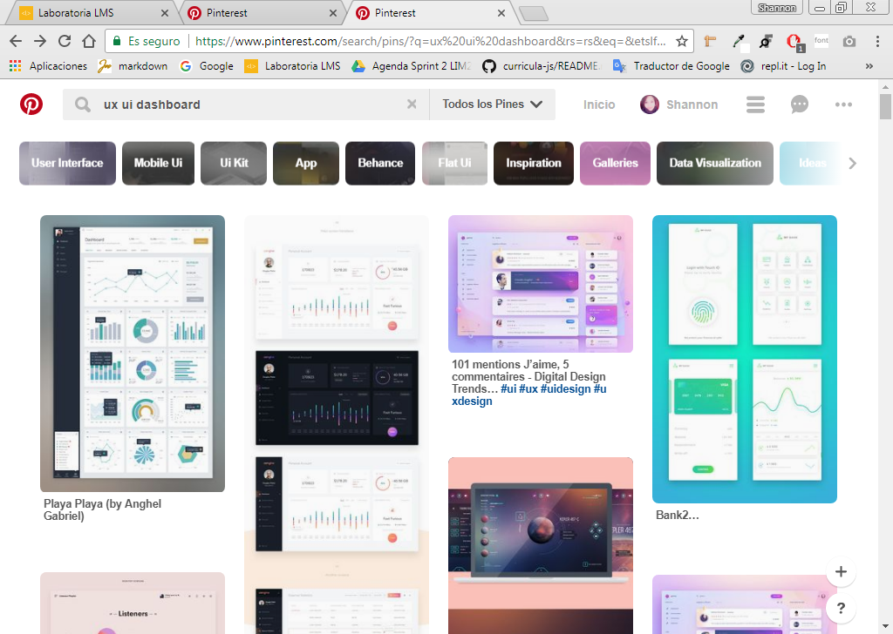
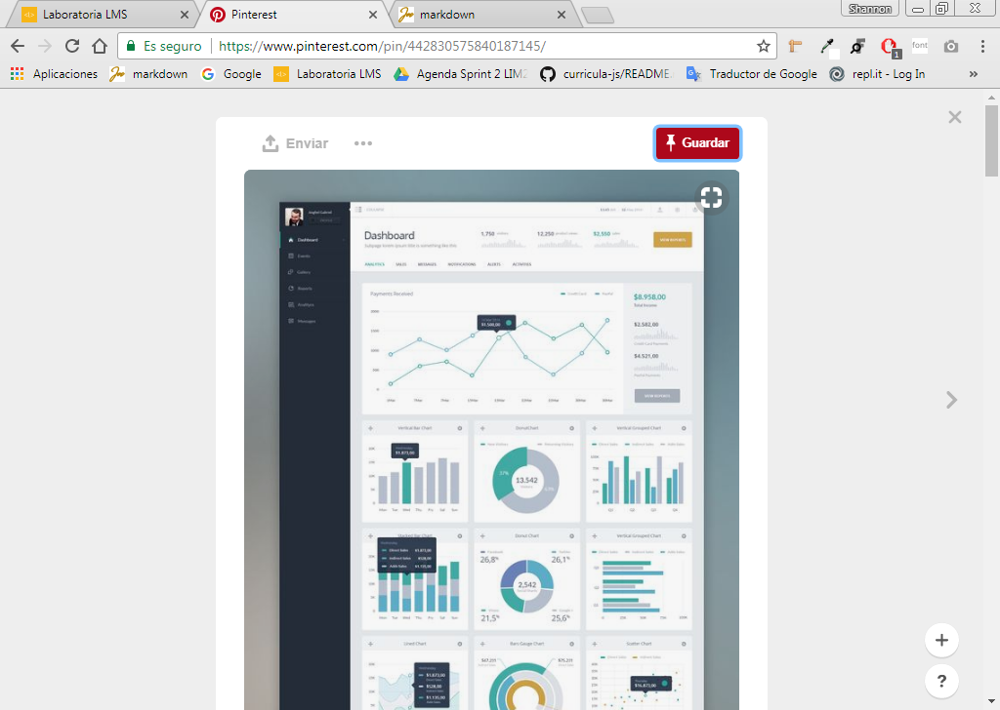
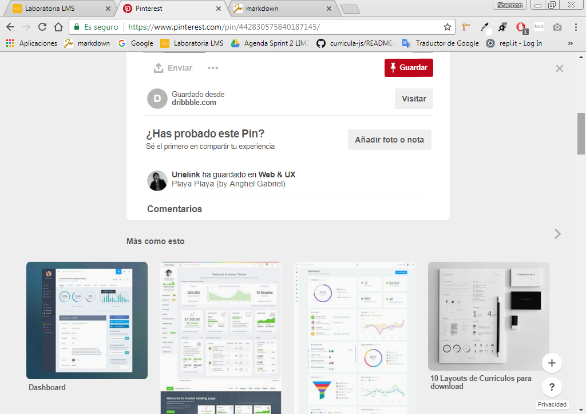

# UX & UI

### Objetivo

Explicar las partes que conforman UX y UI de la siguiente página:

* Pinterest

## Pinterest

|             UX          |            UI          |
|-------------------------|------------------------|
|- Que tenga una barra buscadora según filtro que se requiera.|- Los colores de la pantalla.|
|- Que haya una barra de navegación facetada.                 |- Diseño de la barra de búsqueda.|
|- Que el deslizamiento sea hacia abajo y tenga 4 filas.      |- Diseño de la barra de navegación facetada.|
|- Que tenga una lista por categorías.                        |- Tipografía e Iconos.|
|- Al hacer clic en una imagen, se guarde en un tablero o compartir en otras redes.|- Diseño de los botones, tamaños, formas y colores. |
|- Que muestre recomendaciones según tu historial de búsquedas.|- Barra de desplazamiento.|
|- Que puedas cargar tus fotos y compartir tableros.           |- Diseño de logo.|
